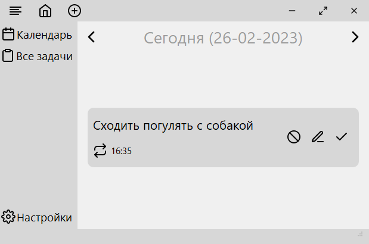

# Планировщик задач
>Создавай напоминания легко и просто! Чтобы не забывать делать всё вовремя!

### Что умеет это программа?
Создание и хранение задач. При создании задач, помимо стандартных функций, можно также указать периодичность повтора задач, что очень облегчает работу с приложением.

### Как начать работать?

- При запуске программы с помощью *.exe файла, она сразу готова к работе. Интерфейс лёгок и интуитивно понятен, но далее будет объяснение многих функций.

### Краткое объяснение функций

- При работе с задачей, можно: удалить её, изменить информацию о ней, а также, отметить выполненной. Всё это интуитивно понятно, так что не будем сильно углубляться.
- Создание новой задачи. Чтобы создать новую задачу требуется нажать на "плюсик", либо же сочетанием клавиш "Ctrl+N". После данных действий у вас появится окно создания задачи.
- Возвращение на главную страницу. Для возвращения требуется нажать на кнопку с изображением дома, она закроет все дополнительные меню. При двойном нажатии, главное меню вернется на сегодняшнее число (при условии, что до этого отображалось другое)
- Меню. При нажатии на кнопку с 4 полосками, откроется меню в котором будут некоторые функции, о которых будет сказано в следующих пунктах
- Календарь. Открывает календарь, при помощи которого можно легко открыть требуемое число. Для этого нужно выбрать нужное число на календаре и нажать кнопку "Найти".
- Все задачи. Отображает все задачи.
- Настройки. Открывает окно, где можно изменить некоторые параметры, связанные с работой приложения.
### Горячие клавиши
- "Ctrl+N" - создание новой задачи
- "Ctrl+H" - возвращение на главную страницу (так-же можно использовать кнопку "Esc")
- "Ctrl+M" - открытие меню
- "Ctrl+K" - открытие календаря
- "Ctrl+T" - отображение всех задач
- "Ctrl+I" - открытие окна настроек
>Удачного использования!